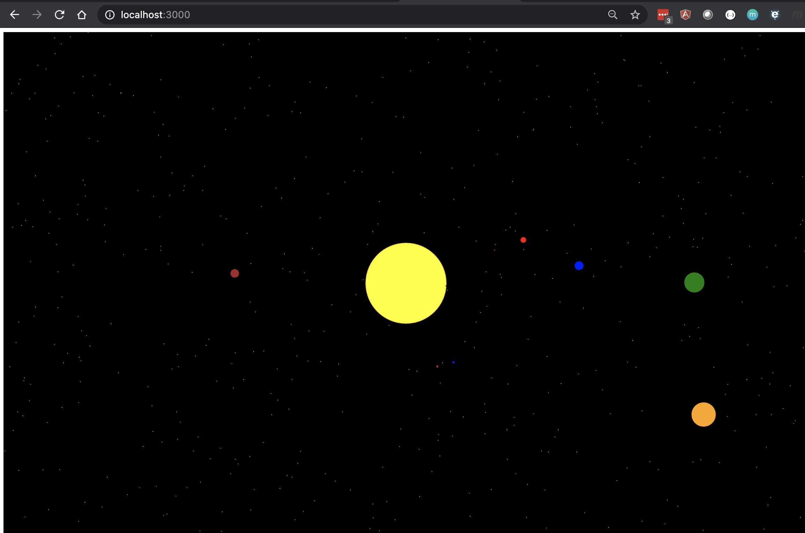

# What is this?
A simple planets simulation in p5 with Simran to show how to code

## How do I run this

1. Install node & npm 

2. Install node HTTP Server

```
npm install --global http-server
```

3. Clone this repository

```
git clone git@github.com:arshimkola/planets-p5-demo.git
```

4. CD to planets-p5-demo folder and start the HTTP Server
```
http-server -c-1 -p 3000 --cors
```

5. Start your fav browser and go to `http://localhost:3000`



See demo on youtube 

[Demo Video](https://www.youtube.com/watch?v=dV3O32WkF1A)

